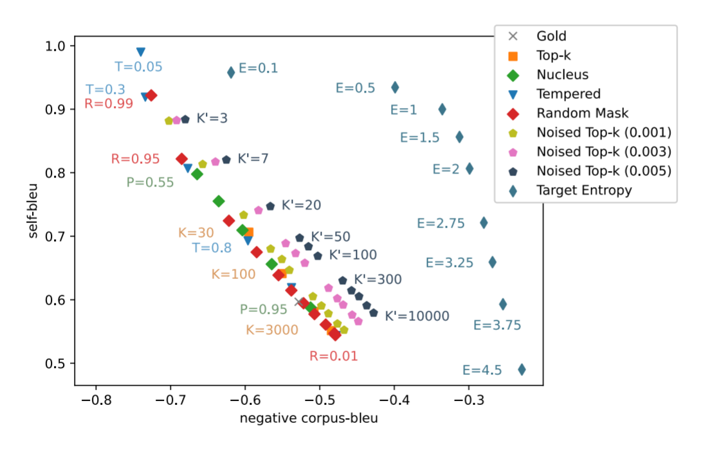

# A Systematic Characterization on Sampling Methods for Open-ended Language Generation 

<p align="center"></p>
     
This repository contains the official implementation of *"A Systematic Characterization on Sampling Methods for Open-ended Language Generation"*, to appear at AACL 2020. 
It also serves as an extensible codebase to design and evaluate various sampling algorithms. We encourage the use of this codebase to design novel sampling algorithms.

## Getting Started
Step 1: First, download the fine-tuned models and shuffled datasets: `cd code && ./download.sh` 

Step 2: Install the requirements: `pip install -r requirements.txt`

## Reproducing Results

#### If you use SLURM

Reproducing this codebase is really easy. 

**Step 1:** Modify `run_job.sh` to meet the constraints of your cluster. For instance, change the partition name, and make sure your SLURM output directory exists.

**Step 2:** Set how many GPUs you have access under `N_GPU` in `sweep_reproduce.sh`, and then run `./sweep_reproduce.sh`. 

If you want to modify hyperparameters, take a look at `sweep.sh`. You can see that we decide which hyperparameters to evaluate for various sampling algorithms.

#### If you don't use SLURM:

We have configured a Makefile that will run all of the commands to reproduce our results. Please be wary that this may take quite a bit of time if you don't have many GPUs. 

Just run `make`!

## Documentation
Most of our code goes under `main.py`, which runs sampling algorithms, computes metrics, and plots the results. 
This is a good example of how to run a sampling algorithm by the command line:

```
python main.py --prefix-length 10 --generation-batch-size 30 \
	--pretrained-class models/gigaword_gpt2 \
	--eval-text data/gigaword/valid.txt_filtered \
	--num-sentences 6000 \
	--results-file results.json \
	FixedSampler --base 3
```

This will run a `Top-K=3` sampling algorithm with conditonal generation from the `args.prefix_file` variable. It will dump a key-value store of sampling meethod arguments: (bleu, self-bleu) for manual inspection in results.json. It will also run a plotter script and plot the Quality-Diversity curves in the plots folder. 
 
If you want to further explore the codebase, run `python3 main.py --help` and it'll describe the various sampling algorithms and hyperparameters that are available.

## Citation
If you find our paper or code relevant to your research, please cite our AACL 2020 paper:
```
@misc{nadeem2020systematic,
    title={A Systematic Characterization of Sampling Algorithms for Open-ended Language Generation},
    author={Moin Nadeem and Tianxing He and Kyunghyun Cho and James Glass},
    year={2020},
    eprint={2009.07243},
    archivePrefix={arXiv},
    primaryClass={cs.CL}
}
```
